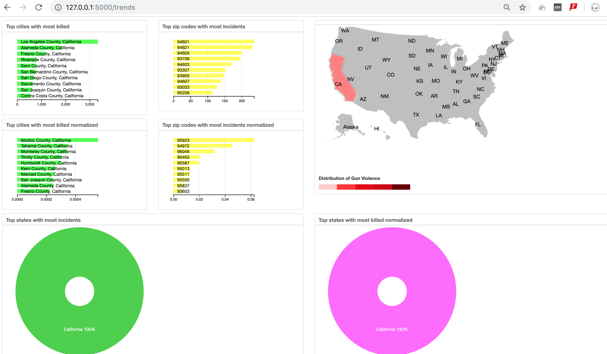

# USA Gun Violence Scout

Crime Rate Scout is an web application that allows user to interactively explore the Gun violence happened between January 2013 and March 2018 within the Range of USA.

User could click a state on the  USA MAP, and system would filter all incident by that clicked state, and visualizes them with coordinated view by showing Num of Victim on that clicked state.

**Allow user to query the gun violence for a zip code within USA, and our system returns safest area in the neighborhood based on number of gun violence, renders the neighbor map with cartographic boundary for each zip code in the near by.**


# System Design

We use gun violence dataset From http://www.gunviolencearchive.org to build an Interactive  Choropleth Map For USA. Using MongoDB for storing and querying the data, Based On Python, We use Flask to interacts with MongoDb. Front-end, we use D3.js, Dc.js and Crossfilter.js to build graph with interactivity.We use [MapShaper](https://github.com/mbloch/mapshaper)  to compress and simplify cartographic boundary dataset the use [cartoDB](https://carto.com)
 to store [cartographic boundary for every Zip Code in USA](https://www2.census.gov/geo/tiger/TIGER2014/ZCTA5/).  And renders the map with cartographic boundary for a list of Zipcode nearby the zipcode that was queried by an user.

A working Demo could be Found [here](https://youtu.be/IH_aBp-L8XA)


After click NY on USA map and group incident by a time range between mid 2014 to mid 2016

View to enable search a safe zip code based on the number of gun violence

Result after search

General coordinated view to show trends of gun violence in USA, like Top cities that people got killed, top zip code people got killed.

now we click CA(California), User even can filter those gun violence to find out the information like top cities(all city of California) that people got killed only for that clicked state(California). Result be like:

## Installation

Download or clone this repository:

```bash
git clone https://github.com/454400098/CRIME_RATE_WEB_APP.git
```
The dependencies for the project can be installed using

```
$ pip install -r requirements.txt
```


## License

MIT License. See [`LICENSE.md`](LICENSE.md).


# To get preprocessed dataset

Please Contact me via  email haodong.zheng@rutgers.edu


## Contact

haodong.zheng@rutgers.edu
